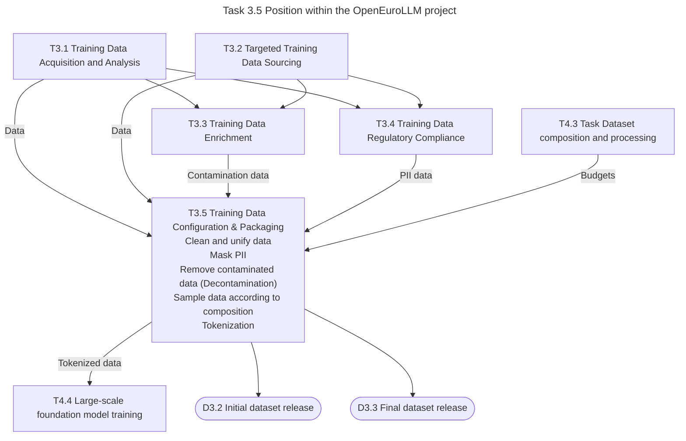

# Training data packager within OpenEuroLLM

The training data packager is developed within the
[OpenEuroLLM](https://https://openeurollm.eu/) project.
The task for development is Task 3.5 Training Data Collection.
The task is dependent upon many other tasks within the project. The following
figure illustrates the position of Task 3.5 within the OpenEuroLLM project.

