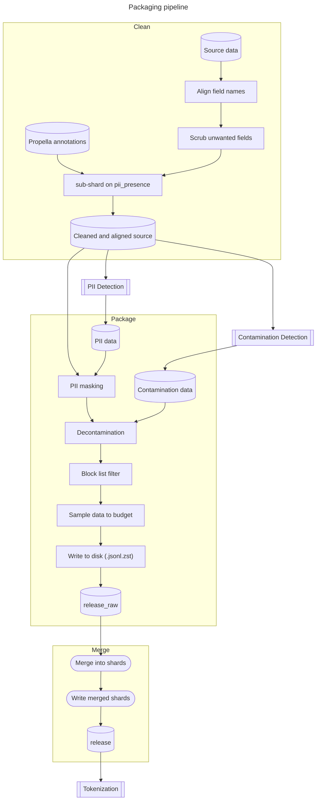

# Pipeline release Baby

This document provides an overview of data processing pipeline of the training
data packager.

## Expected file structure
The structure of a dataset is as follows:
```
dataset-directory/
    metadata.yaml
    source/
    pii/
    contamination/
```
`source` is where the source data is. It can be a hierarchy of directories.
`pii` contains files with the same name as the source files where the content
describe what PII-data need to be masked in the deliverable.
`contamination` containes files with the same name as the source files where
the content describe what documents to remove, due to similarity to benchmark
data, from deliverable.

## metadata.yaml
Each dataset is described with a metadata file (`metadata.yaml`), which contains
essential information such as dataset name, description, source, and any other
relevant details required for the packaging process.

Example of a `metadata.yaml`:
```yaml
name: HPLT 3.0
url: https://hplt-project.org/datasets/v3.0
catalogue: hplt/3.0/sorted
suffix: .jsonl.gz
text: text
id: id
annotations:
  contamination:
    owner: Department B
    status: complete
  pii:
    owner: Department A
    status: complete
    suffix: .jsonl
  propella:
    suffix: .parquet
release:
  default:
    sample: full
    pack: tree
    shard: 117md
    scrub:
      - xml
      - md
  eng_Latn:
    sample: random
    budget: 65%
  swe_Latn:
    block:
      - 6d1f3087-fcdb-4a84-bd64-00edc2862472
```

The field `name` is just a name of the data set and `url` is the orgin of the data.
`catalogue` tells where orginal source resides on the system, relative root to the data
catalogue.

Next three fields are the first to be used by the packager:
* `suffix` is the suffix of the source files. Currently `.jsonl`, `.jsonl.gz`,
  `.jsonl.zst`, and `.jsonl.zstd` are supported.
* `text` is used to tell what field contains the document, defaulkt is `text`
* `id` is used to tell what field contains the document identifier, default is `id`

For both `id` and `field` hierarchies of json objects are accepted. These are separated
by dot-notation, `metadata.WARC-Record-ID`.

`annotations` section describe other processing data such as pii, contamination, and propella.
The fields `owner` and `status` are informative. If suffix is different for these datasets,
a `suffix` field can be used.

The `release` section contains definitions for different sub-dataset of our dataset, named parts.
In this example it is one part per language. The `default` part is used to set default values for
the parts. In this example the `swe_Latn` part will get sample method full.

For each part in release a sampling method can be pointed out in the field `sample`. Three methods are currently
supported:

* `full` - Keep all data
* `random` - Keep a random fraction of the dataset based on the field `budget`. `65%` means we keep 65% of the records.
* `wds+register` - Requires the documents are decorated with Web Docs Scorer. Down- and up-sampling is done based on the scores.

Each part can have a block-list, field `block`, containing a list of documents to be removed. The
intended use is to remove documents with issues. The block-list shall be kept to a minimum.

To remove some fields in the deliverable, use the field `scrub`. This field contains a list of fields
to be removed from the deliverable.

The field `shard` defines how many documents to be included per shard in the deliverable. This reduce the
number of shards and make them more even in size.

The field `pack` can have value `flat` or `tree`. If `tree` the structure of parts is kept.

When `flat` the data from parts are put in the root of the release directory. If the field
`prefix` is set for each part (must be unique) files from the part will be prefixed. If `prefix`
is not set all parts will be merged into common shards.

## Pipeline

The pipeline consists of two stages:
* package - Filter and format the data. This produce data to a `release_raw` directory.
* merge - Merge into reduced number of shards with even size. This produce data to `release` directory.


