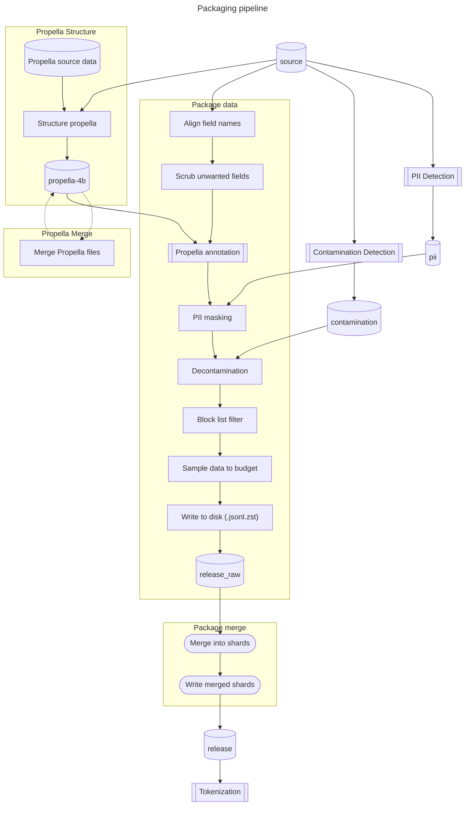

# Pipeline release Flag

This document provides an overview of data processing pipeline of the training
data packager.

The pipeline consists of the following main:
* Propella structure - Pre-processing of Propella data to match source data. This produce the `propella-4b` directory.
* Propella merge - Merge Propella data if not fit into memory.
* PII Detection - Externa step to detect PII data. This produce the `pii` directory.
* Contamination detection - External step to detect data existing in benchmarks.
  This produce the `contamination` directory.
* package - Filter and format the data. This produce data to a `release_raw` directory.
* merge - Merge into reduced number of shards with even size. This produce data to `release` directory.
* Tokenization - External step to tokenize the data. This produce the `megatron-lm` directory.

